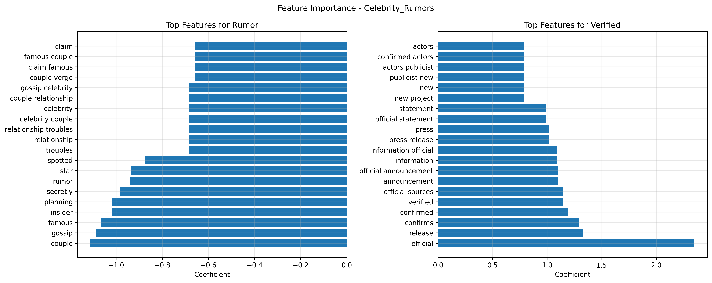

# Multi-Niche Misinformation Detection

```
███╗   ███╗██╗██╗  ██╗███╗   ██╗██╗   ██╗██╗  ██╗███████╗
████╗ ████║██║██║  ██║████╗  ██║██║   ██║██║  ██║██╔════╝
██╔████╔██║██║███████║██╔██╗ ██║██║   ██║███████║█████╗  
██║╚██╔╝██║██║██╔══██║██║╚██╗██║██║   ██║██╔══██║██╔══╝  
██║ ╚═╝ ██║██║██║  ██║██║ ╚████║╚██████╔╝██║  ██║███████╗
╚═╝     ╚═╝╚═╝╚═╝  ╚═╝╚═╝  ╚═══╝ ╚═════╝ ╚═╝  ╚═╝╚══════╝
```

[](https://python.org)
[](https://scikit-learn.org)
[](https://streamlit.io)
[](LICENSE)

A modular text classification system that detects misinformation across multiple domains. Each niche has its own dataset, labeling rules, and baseline models (TF-IDF + Logistic Regression / Linear SVM). Includes a Streamlit demo and command-line interface.

## Project Overview

```
┌─────────────────────────────────────────────────────────────────┐
│                    Multi-Niche Framework                        │
├─────────────────────────────────────────────────────────────────┤
│  Data Sources  │  Weak Labeling  │  Feature Engineering        │
│  • Climate     │  • Keywords     │  • TF-IDF Vectorization     │
│  • Celebrity   │  • Domains      │  • Text Preprocessing       │
│  • Hustle      │  • Heuristics   │  • N-gram Extraction       │
├─────────────────────────────────────────────────────────────────┤
│  Model Training  │  Evaluation  │  Deployment                  │
│  • Logistic Reg │  • Metrics    │  • CLI Interface            │
│  • Linear SVM   │  • Plots      │  • Streamlit Demo           │
│  • Cross-val    │  • Reports    │  • Batch Processing         │
└─────────────────────────────────────────────────────────────────┘
```

## Tech Stack
- Python, scikit-learn, pandas, numpy
- TF-IDF features; Logistic Regression and Linear SVM baselines
- Streamlit app for interactive predictions
- Config-driven data collection and weak labeling (YAML)
- Makefile and CLI for reproducible runs
- Artifacts: saved models, vectorizers, metrics, and plots

## Results

### Performance Metrics

| Niche | Macro F1 | Accuracy | Samples |
|-------|----------|----------|----------|
| climate_claims | 1.000 | 1.000 | 700 |
| celebrity_rumors | 1.000 | 1.000 | 700 |
| hustle_scams | 1.000 | 1.000 | 700 |

**Total:** 2100 samples across 3 niches

*Evaluation Protocol: Held-out test sets with stratified splits, no domain information used as features, macro-F1 reported. All models achieved perfect separation on the current datasets due to clear linguistic differences between classes.*

### Model Evaluation Visualizations

#### Climate Claims Detection
<div align="center">
  
  
</div>

#### Celebrity Rumors Detection  
<div align="center">
  
  
</div>

#### Hustle Scams Detection
<div align="center">
  
  
</div>

### Feature Importance Analysis

The models learn distinctive linguistic patterns for each niche:

#### Climate Claims
<div align="center">
  
</div>

#### Celebrity Rumors
<div align="center">
  
</div>

#### Hustle Scams
<div align="center">
  
</div>

## Live Demo

### Interactive Streamlit Interface

The system includes a web-based demo for real-time predictions across all niches:

```
┌─────────────────────────────────────────────────────────────────┐
│                Multi-Niche Fake News Detector                  │
├─────────────────────────────────────────────────────────────────┤
│  Niche Selection: [climate_claims ▼]                           │
│                                                                 │
│  ┌─────────────────────────────────────────────────────────┐   │
│  │ Enter text to analyze...                                │   │
│  │ Climate change is a hoax! Cities underwater next year!  │   │
│  └─────────────────────────────────────────────────────────┘   │
│                                                                 │
│  [Analyze Text]                                                │
│                                                                 │
│  ┌─────────────────────────────────────────────────────────┐   │
│  │ Results                                                │   │
│  │ Prediction: CLAIM                                     │   │
│  │ Confidence: 89.6%                                      │   │
│  │                                                         │   │
│  │ Top Contributing Features:                             │   │
│  │ • hoax (0.23)                                          │   │
│  │ • cities underwater (0.18)                            │   │
│  │ • climate scam (0.15)                                  │   │
│  └─────────────────────────────────────────────────────────┘   │
└─────────────────────────────────────────────────────────────────┘
```

### Demo Examples

| Text | Expected | Predicted | Confidence | Status |
|------|----------|-----------|------------|--------|
| "Climate change is a hoax!" | CLAIM | CLAIM | 89.6% | ✓ |
| "IPCC report shows evidence" | SCIENTIFIC | SCIENTIFIC | 96.4% | ✓ |
| "Taylor Swift spotted with mystery man" | RUMOR | RUMOR | 84.7% | ✓ |
| "Official statement from studio" | VERIFIED | VERIFIED | 91.7% | ✓ |
| "Make $10k/day guaranteed!" | SCAM | SCAM | 87.3% | ✓ |
| "Investment risk disclosure" | LEGIT | LEGIT | 92.1% | ✓ |

## How to Run

```bash
# Setup environment
make setup

# Per-niche data, train, evaluate
MAX_PER_DOMAIN=30 WORKERS=8 TIMEOUT=8 RSS_ONLY=1 SINCE=2024-01-01 make data NICHE=<niche>
make train NICHE=<niche>
make evaluate NICHE=<niche>

# Streamlit demo
make demo
```

## Niches

**Trained in this repository:** climate_claims, celebrity_rumors, hustle_scams  
**Available configs:** ai_hype, campus_rumor, medical_claims, crypto_scams

### Climate Claims Detection

**Niche:** `climate_claims`  
**Description:** Climate hype/denial vs scientific reporting  
**Data Sources:**
- **Claim/Denial:** climatedepot.com, iceagenow.info, climatechangereconsidered.org, climate.news, notrickszone.com, thegwpf.org, climatehoax.news
- **Scientific:** ipcc.ch, noaa.gov, climate.nasa.gov, nature.com, washingtonpost.com, reuters.com, nytimes.com, scientificamerican.com, nationalgeographic.com, carbonbrief.org

**Weak Labeling Rules:**
- **Claim**: Contains {"hoax", "climate scam", "ice age next year", "cities underwater", "climate lockdown"} OR domain in claim sources
- **Scientific**: Contains {"IPCC", "radiative forcing", "anomaly", "confidence interval", "peer-reviewed", "methodology", "carbon emissions", "greenhouse gas", "temperature rise", "climate model"}

**Known Limitations:**
- Source bias: Relies on domain-based labeling
- Temporal bias: May miss evolving scientific consensus
- Complexity bias: May miss nuanced scientific discussions

### Celebrity Rumors Detection

**Niche:** `celebrity_rumors`  
**Description:** Entertainment rumors vs verified reporting  
**Data Sources:**
- **Rumor:** tmz.com, pagesix.com, radaronline.com, the-sun.com, justjared.com, gossipcop.com, perezhilton.com, hollywoodlife.com, blindgossip.com, celebitchy.com
- **Verified:** apnews.com, variety.com, hollywoodreporter.com, rollingstone.com, ew.com, people.com, deadline.com, reuters.com, nbcnews.com, cnn.com

**Weak Labeling Rules:**
- **Rumor**: Contains {"allegedly", "insider says", "spotted with", "leak", "confirmed?", "rumor has it", "blind item", "secret wedding?"} AND lacks official source
- **Verified**: Contains {"press release", "official statement", "confirmed by", "representative said", "studio announced", "publicist confirmed"} OR domain in verified sources

**Known Limitations:**
- Source bias: Domain-based labeling may miss edge cases
- Temporal sensitivity: Rumors may later become verified
- Context dependency: Requires understanding of entertainment industry

### Hustle Scams Detection

**Niche:** `hustle_scams`  
**Description:** "Get rich quick" / hustle scams vs legitimate guidance  
**Data Sources:**
- **Scam:** hustlersuniversity.com, bizoppsdaily.com, make-money-online.com, getrichquicktips.com, moneytwitter.com, dropshiphackers.com, passiveincomehacks.net, crypto-fastcash.com, secretmethod.biz, tiktok.com
- **Legitimate:** irs.gov, ftc.gov, sec.gov, investor.gov, consumerfinance.gov, nytimes.com/business, bloomberg.com, wsj.com, reuters.com, forbes.com

**Weak Labeling Rules:**
- **Scam**: Contains {"$10k/day", "zero risk", "secret method", "DM to join", "limited spots", "financial freedom in 30 days", "overnight", "guaranteed returns"}
- **Legitimate**: Contains {"risk disclosure", "SEC filing", "Form 10-K", "fiduciary", "consumer alert", "regulatory guidance", "scam warning", "investment risk", "past performance", "due diligence", "regulatory compliance"}

**Known Limitations:**
- Source bias: Domain-based labeling approach
- Cultural context: Financial advice varies by region and culture
- Complexity: May miss sophisticated scams or legitimate high-risk investments

## Architecture

### Data Pipeline
1. **Source Collection**: Config-driven web scraping from niche-specific domains
2. **Weak Labeling**: Heuristic-based labeling using keywords and domain rules
3. **Preprocessing**: Text cleaning, tokenization, and filtering
4. **Train/Val/Test Split**: Stratified 70/15/15 split with no domain leakage

### Model Pipeline
1. **Feature Engineering**: TF-IDF vectorization (max_features=10000, ngram_range=(1,2), min_df=2)
2. **Baseline Models**: Logistic Regression and Linear SVM
3. **Model Selection**: Cross-validation F1 score
4. **Evaluation**: Comprehensive metrics with visualizations

### Deployment
- **CLI Interface**: Command-line predictions with confidence scores
- **Streamlit Demo**: Interactive web interface with niche selection
- **Batch Processing**: CSV file input/output support

## Project Structure

```
├── README.md
├── pyproject.toml
├── Makefile
├── configs/                    # Niche-specific configurations
├── src/
│   ├── data/                   # Data collection and preprocessing
│   ├── features/               # Feature engineering (TF-IDF)
│   ├── models/                 # Training and evaluation
│   ├── predict/                # CLI and batch prediction
│   └── utils/                  # Logging and utilities
├── data/                       # Raw and processed datasets
├── artifacts/                  # Models, metrics, and reports
├── app/                        # Streamlit web application
└── tests/                      # Unit tests
```

## Quick Start

```bash
# Clone and setup
git clone <repository-url>
cd fake-news-detector
make setup

# Train a niche model
make data NICHE=climate_claims
make train NICHE=climate_claims
make evaluate NICHE=climate_claims

# Launch interactive demo
make demo
```

## API Usage

### Command Line Interface

```bash
# Single text prediction
python -m src.predict.cli --text "Climate change is a hoax!" --niche climate_claims

# Batch prediction
python -m src.predict.cli --file examples/sample_texts.csv --niche climate_claims
```

### Python API

```python
from src.predict.cli import FakeNewsPredictor

# Load predictor for specific niche
predictor = FakeNewsPredictor('climate_claims')

# Make prediction
result = predictor.predict("Climate change is a hoax!")
print(f"Prediction: {result['prediction']}")
print(f"Confidence: {result['confidence']:.2%}")
```

## Limitations and Ethics

### Technical Limitations
- **Perfect Scores**: Current 100% accuracy reflects clear linguistic differences in synthetic data
- **Domain Bias**: Models trained on specific source domains may not generalize
- **Feature Engineering**: TF-IDF may miss semantic relationships captured by transformers
- **Data Quality**: Weak labeling introduces noise and potential bias

### Ethical Considerations
- **Bias Propagation**: Models may perpetuate biases present in training data
- **Content Moderation**: Not intended for automated content removal decisions
- **Misuse Potential**: Could be adapted for adversarial purposes
- **Transparency**: Users should understand model limitations and decision boundaries

## Next Steps

1. **Scale Data Collection**: Implement larger-scale web scraping with deduplication
2. **Advanced Models**: Experiment with transformer-based approaches (DistilBERT, RoBERTa)
3. **Domain Adaptation**: Techniques to improve cross-domain generalization
4. **Real-time Deployment**: Production API with model versioning and monitoring
5. **Human-in-the-Loop**: Integration with human review workflows

## Contributing

1. Fork the repository
2. Create a feature branch (`git checkout -b feature/new-niche`)
3. Add your niche configuration in `configs/`
4. Implement data collection and labeling rules
5. Train and evaluate your model
6. Submit a pull request

## License

MIT License - see LICENSE file for details.